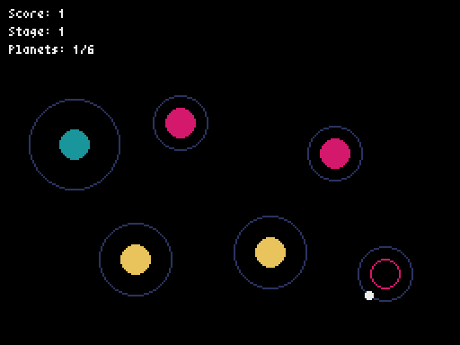

# Orbital Journey

A 2D space exploration game built with Python and Pyxel where you control an orbiter using planetary gravity fields to visit planets across multiple stages.



## Game Overview

Navigate through space using slingshot maneuvers around planets. Visit all planets in each stage to advance to the next level. Your goal is to achieve the highest score by visiting as many planets as possible across multiple stages.

## Features

- **Realistic Orbital Mechanics**: Orbiter follows realistic orbital physics around planets
- **Three Gravity Levels**: Planets have weak (green), medium (yellow), or strong (red) gravity fields
- **Dynamic Rotation**: Orbital direction changes based on approach angle
- **Stage Progression**: Complete stages by visiting all planets
- **Visual Feedback**: Visited planets show as outlines, unvisited as filled circles
- **Score Tracking**: Cumulative scoring across all stages

## Controls

- **Space Key**: Leave current orbit / Start game (from title screen)
- **Space Key**: Restart game (from game over screen)

## Gameplay

1. **Start**: Your orbiter begins orbiting a random planet
2. **Navigate**: Press Space to leave orbit and travel in a straight line
3. **Capture**: Get captured by another planet's gravity field to enter its orbit
4. **Progress**: Visit all planets to advance to the next stage
5. **Survive**: Avoid colliding with planets or screen boundaries

## Game Over Conditions

- Collision with a planet
- Traveling outside the screen boundaries

## Installation

### Requirements

- Python 3.7+
- Pyxel

### Setup

1. Clone the repository:
```bash
git clone https://github.com/gebadev/orbitaljourney.git
cd orbitaljourney
```

2. Install dependencies:
```bash
pip install -r requirements.txt
```

3. Run the game:
```bash
python main.py
```

## File Structure

```
orbital2/
├── main.py          # Main entry point
├── game.py          # Game class with main game logic
├── orbiter.py       # Orbiter class
├── planet.py        # Planet class
├── constants.py     # Game constants
├── requirements.txt # Python dependencies
└── README.md       # This file
```

## Game Mechanics

### Orbital Physics
- Orbiter follows elliptical orbits around planets
- Orbital radius depends on planet's gravity strength
- Rotation direction determined by approach angle

### Gravity Types
- **Weak Gravity (Green)**: Large orbital radius, easier to escape
- **Medium Gravity (Yellow)**: Medium orbital radius
- **Strong Gravity (Red)**: Small orbital radius, harder to escape

### Scoring System
- Score increases only when visiting new planets
- Revisiting planets doesn't add to score
- Score accumulates across stages

## Development

Built with:
- **Python**: Core game logic
- **Pyxel**: 2D game engine for graphics and input handling

## License

This project is open source. Feel free to contribute or modify as needed.

## Contributing

1. Fork the repository
2. Create a feature branch
3. Make your changes
4. Submit a pull request

## Screenshots

*Add screenshots of your game here when ready*

---

Have fun exploring space! 🚀